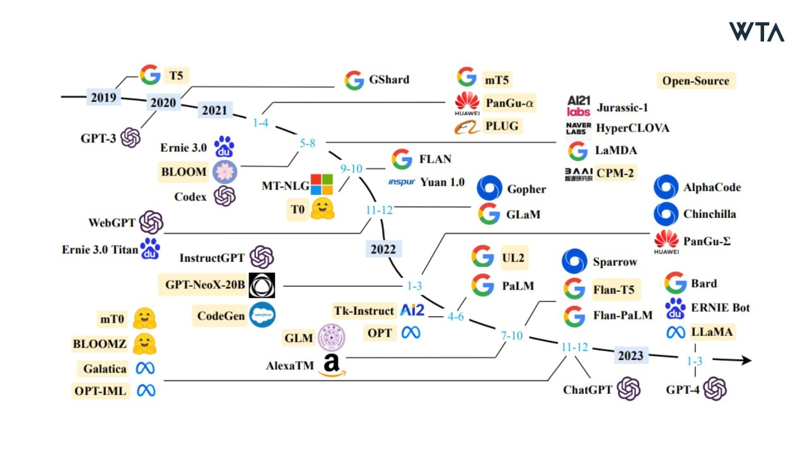
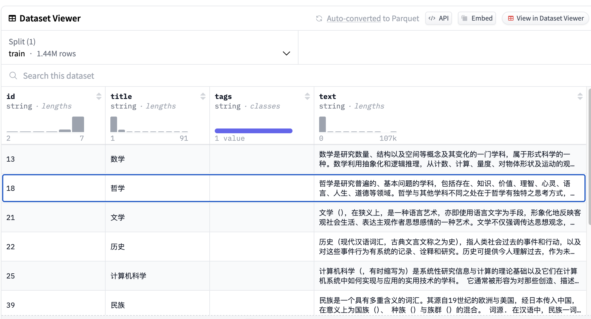
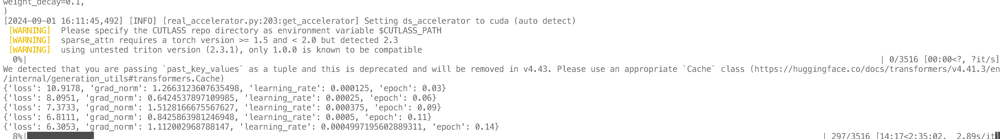
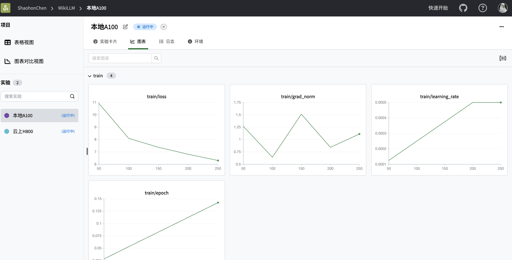

# transformers_from_scratch

大语言模型（Large Language Model，简称LLM），指使用大量文本数据训练的深度学习模型，可以生成自然语言文本或理解语言文本的含义。



虽然网上有大量关于transformer理论、大语言模型微调的教程。但是少有关于预训练的解释。本文则从如何自己实战预训练一个大语言模型的角度，使用wiki数据集进行一个简单的从零预训练工作，并附上使用swanlab launch白嫖显卡的方法

* 实验记录：[SwanLab](https://swanlab.cn/@ShaohonChen/WikiLLM/overview)

* 数据集下载：[百度网盘](.link)，[huggingface](https://huggingface.co/datasets/fjcanyue/wikipedia-zh-cn)

---

## 安装环境

首先，项目推荐使用python3.10。需要安装的python包如下：

```txt
swanlab
transformers
datasets
accelerate
```

使用如下命令一键安装：

```bash
pip install swanlab transformers datasets accelerate modelscope
```

---

## 下载数据集

本教程使用的是中文wiki数据，理论上预训练数据集种类越丰富、数据量越大越好，后续会增加别的数据集。



huggingface链接：[wikipedia-zh-cn](https://huggingface.co/datasets/fjcanyue/wikipedia-zh-cn)

百度网盘下载地址：[百度网盘](.link)

下载`wikipedia-zh-cn-20240820.json`文件后放到项目目录下`./data/`文件夹中

该数据集文件约1.99G大，共有1.44M条数据。虽然数据集中包含文章标题，但是实际上在预训练阶段用不上。正文片段参考：

```txt
数学是研究数量、结构以及空间等概念及其变化的一门学科，属于形式科学的一种。数学利用抽象化和逻辑推理，从计数、计算、量度、对物体形状及运动的观察发展而成。数学家们拓展这些概念...
```

使用[🤗Huggingface Datasets](https://huggingface.co/docs/datasets/index)加载数据集的代码如下：

```python
from datasets import load_dataset

ds = load_dataset("fjcanyue/wikipedia-zh-cn")
```

如果使用百度网盘下载的json文件，可以通过如下代码加载

```python
raw_datasets = datasets.load_dataset(
    "json", data_files="data/wikipedia-zh-cn-20240820.json"
)

raw_datasets = raw_datasets["train"].train_test_split(test_size=0.1, seed=2333)
print("dataset info")
print(raw_datasets)
```

---

## 运行训练

运行如下命令

```
python pretrain.py
```

可以看到如下训练日志。由于训练时间较长，推荐使用tmux将训练任务hold住



可以在[SwanLab](https://swanlab.cn)中查看最终的训练结果：


